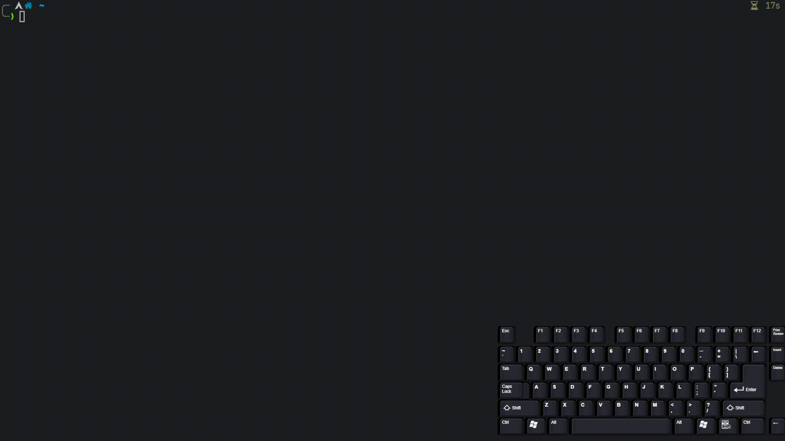

# README - tmux-session
Manage your tmux sessions using fzf.



# Contents
- [Introduction](#introduction)
- [Installation](#installation)
- [Usage](#usage)
- [Configuration](#configuration)
- [Troubleshooting](#troubleshooting)
- [Contributing](#contributing)
- [License](#license)

# Introduction
`tmux-session` is a script that allows you to manage your tmux sessions using
fzf. It allows you to: 
- create or attach to sessions using fzf
- create or attach to sessions using a keybinding
- run a hook after creating a session  

This repository is heavily inspired on ThePrimeagen's [tmux-sessionizer](https://github.com/ThePrimeagen/.dotfiles/blob/master/bin/.local/scripts/tmux-sessionizer).

# Installation
Ensure that you have the following tools installed:
- [fzf](www.github.com/junegunn/fzf)

Next, run the following command to install `tmux-session` in the 
`/usr/local/bin` directory.
```bash
local tmp_dir=$(mktemp -d);
git clone https://github.com/BartSte/tmux-session.git $tmp_dir;
sudo $tmp_dir/install;
rm -rf $tmp_dir;
```
# Usage

## New session / attach to session
Create a new tmux session as follows:
```bash
tmux-session ~/project_1
```
where `~/project_1` is the directory you want to create a session for. You can
run this command with, or without having tmux running.

If you want to attach to an existing session (e.g. `~/project_1`), run the same
command as above. If the session already exists, you will be attached to it. If
the session does not exist, a new session will be created.

## New session / attach to session using fzf
If you do not want to specify the directory, you can use fzf to select one. To
do so, run the following command:
```bash
tmux-session
```
This will open fzf and allow you to select a directory. If the directory    
corresponds to an existing session, you will be attached to it. If the session
does not exist, a new session will be created.

## Hook
You can run a hook after creating a session. To do so, supply your command 
after the `--hook` option. For example:
```bash
tmux-session ~/project_1 --hook "echo 'hello world'"
```
A more useful example would be:
```bash
tmux-session ~/project_1 --hook 'tmux set -t $name status-left-style fg=color220'
```
This will set the status bar color to a nice orange color. Here `$name` is a
variable that is set by `tmux-session`. It contains the name of the session.

# Configuration

## Fzf
You can configure `tmux-session` by placing a configuration file at 
`~/.config/tmux-session/dirs`. This file should contain a list of directories
that you want to be able to select from using fzf. For example:
```bash
~/project_1
~/project_2
~/project_3
```
If you do not want to use a configuration file, you can also set the
`--config` option. For example:
```bash
tmux-session --config ~/my_config
```

## Keybindings
I strongly recommend you to set up a keybinding to create/switch between
sessions you use often. To do so, you can use the following as an example:
```bash
hook='tmux set -t $name status-left-style'
bind-key -r f run-shell "tmux neww tmux-session"
bind-key -r H run-shell "tmux-session ~" 
bind-key -r P run-shell "tmux-session ~/project_1/ --hook '$hook fg=colour200'"
```
This configuration does the following:
- `f`: opens fzf to select a directory to create a session for
- `H`: creates a session for the home directory
- `P`: creates a session for `~/project_1` and sets the status bar color to a
  orange color so you can easily distinguish it from other sessions

# Troubleshooting
If you encounter any issues, please report them on the issue tracker at:
[tmux-session issues](https://github.com/BartSte/tmux-session/issues)

## Contributing
Contributions are welcome! Please see [CONTRIBUTING](./CONTRIBUTING.md) for
more information.

# License
Distributed under the [MIT License](./LICENCE).
